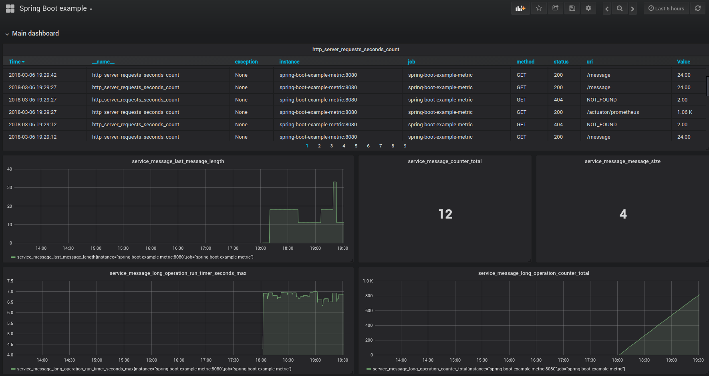
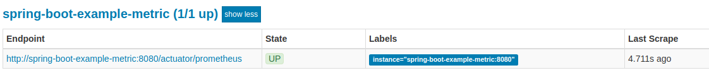
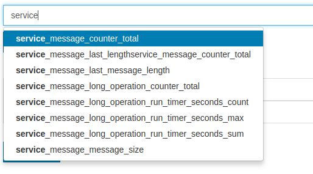
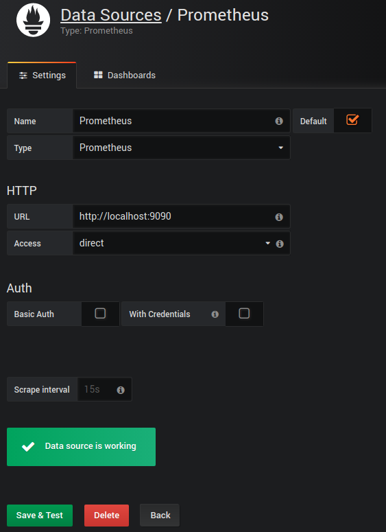

# Spring Boot 2.0 metrics with Actuator, Prometheus and Grafana example



## Intro:

 - [Spring Boot Actuator](https://docs.spring.io/spring-boot/docs/current/reference/html/production-ready.html)
 - [Prometheus](https://prometheus.io/)
 - [Grafana](https://grafana.com/)

## How to...

implement metrics in Spring Boot and export to Prometheus and Grafana?

#### 1. Create new Spring Boot application

or use exist one

#### 2. Add dependencies to your project

```gradle
compile('org.springframework.boot:spring-boot-starter-actuator')
runtime("io.micrometer:micrometer-registry-prometheus")
```

#### 3. Expose metrics and prometheus endpoints in application.properties

```
management.endpoints.web.exposure.include=health,info,metrics,prometheus
```

#### 4. Use prepared metrics by Spring creators or create custom metrics for your app

Inject MeterRegistry, create and manage your application set of meters.
Example:
```kotlin
    @Autowired
    fun setCounter(meterRegistry: MeterRegistry) {
        //counters -> increment value
        messageCounter = meterRegistry.counter("service.message.counter")
        operationCounter = meterRegistry.counter("service.message.long.operation.counter")

        //gauges -> shows the current value of a meter.
        lastMessageLength = meterRegistry.gauge("service.message.last.message.length", AtomicInteger())!!
        //shows collection size (queue message, cache size etc...). In real app the collection implementation used should be thread safe.
        messages = meterRegistry.gaugeCollectionSize("service.message.message.size", emptyList(), mutableListOf())!!

        //timer -> measures the time taken for short tasks and the count of these tasks.
        timer = meterRegistry.timer("service.message.long.operation.run.timer")

        //other meters...
    }
```

#### 5. Run you application

For example:
```bash
./gradlew bootRun
```

#### 6. Check your working metrics (JSON format)

```bash
curl http://localhost:8080/actuator/metrics
{"names":["jvm.buffer.memory.used","jvm.memory.used","jvm.gc.memory.allocated","jvm.memory.committed","tomcat.sessions.created","tomcat.sessions.expired","tomcat.global.request.max","tomcat.global.error","jvm.gc.max.data.size","service.hello.operation.run.timer","service.message.operation.counter","logback.events","system.cpu.count","jvm.memory.max","jvm.buffer.total.capacity","jvm.buffer.count","process.files.max","jvm.threads.daemon","process.start.time","service.message.counter","tomcat.global.sent","tomcat.sessions.active.max","tomcat.threads.config.max","service.message.last.length","jvm.gc.live.data.size","process.files.open","process.cpu.usage","service.message.message.size","tomcat.servlet.request","process.uptime","tomcat.global.received","system.load.average.1m","tomcat.cache.hit","http.server.requests","jvm.gc.pause","tomcat.servlet.error","tomcat.servlet.request.max","tomcat.cache.access","tomcat.threads.busy","tomcat.sessions.active.current","system.cpu.usage","jvm.threads.live","jvm.classes.loaded","jvm.classes.unloaded","jvm.threads.peak","tomcat.threads.current","tomcat.global.request","jvm.gc.memory.promoted","tomcat.sessions.rejected","tomcat.sessions.alive.max"]}%   
```

#### 7. Check your working metrics (Prometheus format)

```bash
curl http://localhost:8080/actuator/prometheus
# HELP jvm_gc_memory_promoted_bytes_total Count of positive increases in the size of the old generation memory pool before GC to after GC
# TYPE jvm_gc_memory_promoted_bytes_total counter
jvm_gc_memory_promoted_bytes_total 24576.0
...
```

#### 8. Check your custom metrics (Prometheus format)

```bash
curl -s http://localhost:8080/actuator/prometheus |grep service_message
# HELP service_message_last_message_length  
# TYPE service_message_last_message_length gauge
service_message_last_message_length 18.0
# HELP service_message_message_size  
# TYPE service_message_message_size gauge
service_message_message_size 4.0
# HELP service_message_long_operation_run_timer_seconds  
# TYPE service_message_long_operation_run_timer_seconds summary
service_message_long_operation_run_timer_seconds_count 74.0
service_message_long_operation_run_timer_seconds_sum 265.597506794
service_message_long_operation_run_timer_seconds_max 6.9341843
...
```

#### 9. Add Spring Boot app scrape config to prometheus.yml

[More info](https://prometheus.io/docs/prometheus/latest/configuration/configuration/)

```
  - job_name: 'spring-boot-example-metric'
  
    # Override the global default and scrape targets from this job every 5 seconds.
    scrape_interval: 5s

    metrics_path: '/actuator/prometheus' # path to spring boot metrics

    static_configs:
      - targets: ['spring-boot-example-metric:8080'] # host and port
```

#### 10. Open Prometheus dashboard

and check Spring Boot endpoint status (menu: Status/Targets)



#### 11. Add dashboard for system or custom metric

(menu: Graph)



#### 12. Open Grafana dashboard 

and add Prometheus data source



#### 13. Create new dashboard for system or custom metric


or use already created.
For example:
[JVM (Micrometer) Dashboard](https://grafana.com/dashboards/4701)


## Working example

### Status

[](https://travis-ci.org/wojciech-zurek/kotlin-spring-boot-prometheus-grafana-example)

### Requirements
Docker and docker-compose

### Stack
 - kotlin
 - gradle
 - spring boot 2.0 (mvc, actuator)
 - docker and docker-compose (I'm using Linux)
 - prometheus
 - grafana

### Download

```bash
    git clone https://github.com/wojciech-zurek/kotlin-spring-boot-prometheus-grafana-example.git
```

### How to build and run

#### 1. Compile project and build docker images
```bash
    cd kotlin-spring-boot-prometheus-grafana-example/
    ./build.sh
```
#### 2. Check docker images
```bash
docker images    
REPOSITORY                                    TAG                 IMAGE ID            CREATED             SIZE
eu.wojciechzurek/spring-boot-example-metric   0.0.1               3499dee25307        About an hour ago   123MB
eu.wojciechzurek/spring-boot-example-metric   latest              3499dee25307        About an hour ago   123MB
eu.wojciechzurek/custom-prometheus            0.0.1               17aaa34718de        About an hour ago   112MB
eu.wojciechzurek/custom-prometheus            latest              17aaa34718de        About an hour ago   112MB
grafana/grafana                               latest              18cae91912fc        5 days ago          301MB
```

#### 3. Run docker-compose

```bash
cd kotlin-spring-boot-prometheus-grafana-example/
docker-compose up
```

#### 4. Check docker containers status

```bash
docker ps
CONTAINER ID        IMAGE                                                COMMAND                  CREATED             STATUS              PORTS                                      NAMES
449f44b8a1d5        eu.wojciechzurek/custom-prometheus:latest            "/bin/prometheus --c…"   41 minutes ago      Up 41 minutes       0.0.0.0:9090->9090/tcp                     kotlinspringbootprometheusgrafanaexample_prometheus_1
348e2b0150be        grafana/grafana                                      "/run.sh"                41 minutes ago      Up 41 minutes       0.0.0.0:3000->3000/tcp                     kotlinspringbootprometheusgrafanaexample_grafana_1
ab91021df26b        eu.wojciechzurek/spring-boot-example-metric:latest   "java -Djava.securit…"   41 minutes ago      Up 41 minutes       0.0.0.0:8080->8080/tcp                     spring-boot-example-metric
```

#### 5. Services URL
 - example spring boot controller: http://localhost:8080/message 
 - Prometheus dashboard http://localhost:9000/ 
 - Grafana dashboard (**login: admin, password: admin**) http://localhost:3000/ 

#### 6. Open Grafana dashboard
and add Prometheus type, direct access source (HTTP URL: http://localhost:9000/)

#### 7. Test app and check metrics
```bash
curl http://localhost:8080/message
Hello Spring World%                               
```
#### 8. Optional upload example dashboard

Go to: [http://localhost:3000/dashboard/import](http://localhost:3000/dashboard/import) and import [grafana-spring-boot-example.json](/grafana-spring-boot-example.json)